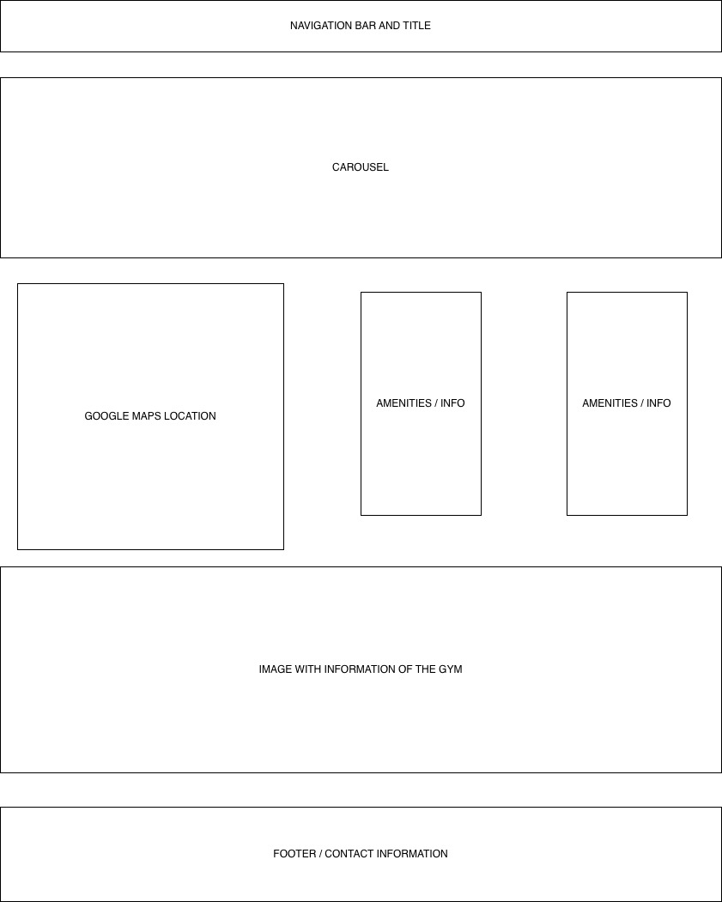
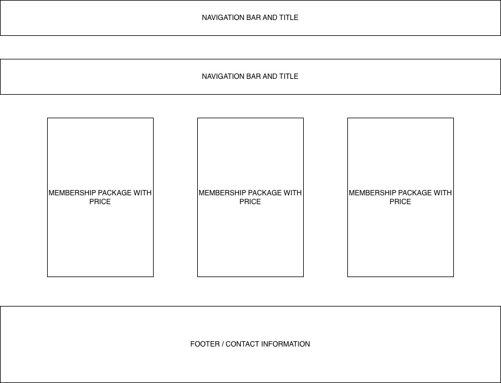
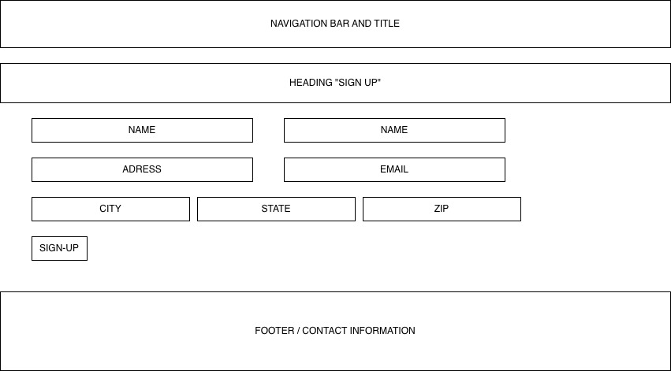

# Project1 
# Developer 
Michael Moore 
# Evolve 360 Fitness
Hello, this is my first buiness website, here you will see I have created a gym website names Evolve 360 Fitness. This website shows a main home page with other pages such as, contact information, sign-up , memberships, locations, & amenities. Wanted to make this website very user friendly, with easy access.
# User Stories
1. Locations and Access - user will see google maps locations on home page with phone number below, making it easy and fast to find the closest gym near you.
2. Memberships & Amenities - user will see 3 types of memberships to choose from, with brief discriptons below to find what best suits them. Easy sign up and user access.
3. Friendly Enviroment and Local Owned - Evolve 360 Fitness pushing clean and happy enviroments to work out in. On our website it shows multiple photos that display a nice and friedly gym. Meant for anyone who wants to join!
# Future updates 
- Dark & Light Mode
- Checkout with credit card input
- Member/Profile page
# Software Used
- HTML/CSS
- Bootstrap v5.3
- Google Fonts
# WIRE FRAME

HTML and CSS assignment (small business website)
